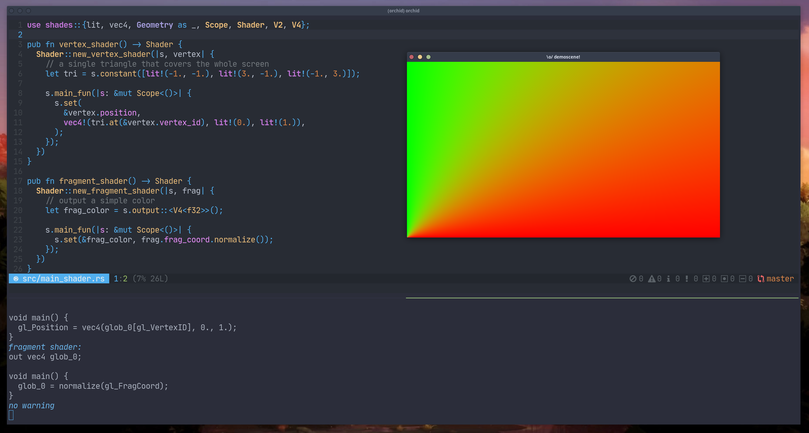

# Shades, a shader EDSL in Rust

This crate provides an [EDSL] to build [shaders], leveraging the Rust compiler (`rustc`) and its type system to ensure
soundness and typing. Because shaders are written in Rust, this crate is completely language agnostic: it can in theory
target any shading language – the current tier-1 language being [GLSL]. The EDSL allows to statically type shaders
while still generating the actual shading code at runtime.

<!-- vim-markdown-toc GFM -->

* [Motivation](#motivation)
  * [Influences](#influences)
* [Why you would love this](#why-you-would-love-this)
* [Why you wouldn’t love this](#why-you-wouldnt-love-this)

<!-- vim-markdown-toc -->

## Motivation

In typical graphics libraries and engines, shaders are _opaque strings_ – either hard-coded in the program, read from
a file at runtime, constructed via fragments of strings concatenated with each others, etc. The strings are passed to
the graphics drivers, which will _compile_ and _link_ the code at runtime. It is the responsibility of the runtime
(i.e. the graphics library, engine or the application) to check for errors and react correctly. Shading languages can
also be compiled _off-line_, and their bytecode is then used at runtime (c.f. SPIR-V).

For a lot of people, this has proven okay for decades and even allowed _live coding_: because the shading code is
loaded at runtime, it is possible to re-load, re-compile and re-link it every time a change happens. However, this comes
with a non-negligible drawbacks:

- The shading code is often checked either at runtime. In this case, ill-written shaders won’t be visible by
  programmers until the runtime is executed and the GPU driver refuses the shading code.
- When compiled off-line are transpiled to bytecode, extra specialized tooling is required (such as an external program,
  a language extension, etc.).
- Writing shaders imply learning a new language. The most widespread shading language is [GLSL] but others exist,
  meaning that people will have to learn specialized languages and, most of the time, weaker compilation systems. For
  instance, [GLSL] doesn’t have anything natively to include other [GLSL] files and it’s an old C-like language.
- Even though the appeal of using a language in a dynamic way can seem appealing, going from a dynamic language and
  using it in a statically manner is not an easy task. However, going the other way around (from a static to dynamic)
  is much much simpler. In other terms: it is possible to live-reload a compiled language with the help of low-level
  system primitives, such as `dlopen`, `dlsym`, etc. It’s more work but it’s possible. And
  [Rust can do it too](https://crates.io/crates/libloading).

The author ([@phaazon]) of this crate thinks that shading code is still code, and that it should be treated as such.
It’s easy to see the power of live-coding / reloading, but it’s more important to provide a shading code that is
statically proven sound and with less bugs that without the static check. Also, as stated above, using a compiled
approach doesn’t prevent from writing a relocatable object, compiled isolated and reload this object, providing roughly
the same functionality as live-coding.

> Important note: this crate **does its best** to catch semantic bugs at compile-time via `rustc`. However, it might
> still lack opportunities to catch all semantic bugs. If you find such a case, please feel free to open an issue to as
> that is considered a bug / regression.

Another important point is the choice of using an EDSL. Some people would argue that Rust has other interesting and
powerful ways to achieve the same goal. It is important to notice that this crate doesn’t provide a compiler to compile
Rust code to a shading language. Instead, it provides a Rust crate that will still generate the shading code at runtime.
Other alternatives would be using a [proc-macro]. Several crates who do this:

- You can use the [glsl] and [glsl-quasiquote] crates. The first one is a parser for GLSL and the second one allows you
  to write GLSL in a quasi-quoter (`glsl! { /* here */  }`) and get it compiled and check at runtime. It’s still
  [GLSL], though, and the possibilities of runtime combinations are much less than an EDSL.
- You can use the [rust-gpu] project. It’s a similar project but they use a proc-macro, compiling Rust code
  representing GPU code. It requires a specific toolchain and doesn’t operate at the same level of this crate — it can
  even compile a large part of the `core` library.

### Influences

- [blaze-html], a [Haskell] [EDSL] to build HTML in [Haskell].
- [selda], a [Haskell] [EDSL] to build SQL queries and execute them without writing SQL strings. This current crate is
  very similar in the approach.

## Why you would love this

If you like type systems, languages and basically hacking compilers (writing code for your compiler to generate the
runtime code!), then it’s likely you’ll like this crate. Among all the features you will find:

- Use vanilla Rust. Because this crate is language-agnostic, the whole thing you need to know to get started is to
  write Rust. You don’t have to learn [GLSL] to use this crate — even though you still need to understand the concept
  of shaders, what they are, how they work, etc. But the _encoding of those concepts_ is now encapsulated by a native
  Rust crate.
- Types used to represent shading types are basic and native Rust types, such as `bool`, `f32` or `[T; N]`.
- Write a more functional code rather than imperative code. For instance, a _vertex shader_ in this crate is basically
  a function taking an object of type `Vertex` and returning another object, that will be passed to the next stage.
- Catch semantic bugs within `rustc`. For instance, assigning a `bool` to a `f32` in your shader code will trigger a
  `rustc` error.
- Make some code impossible to write. For instance, you will not be able to use in a _vertex shader_ expressions only
  valid in the context of a _fragment shader_, as this is not possible by their own definitions.
- Extend and add more items to famous shading languages. For instance, [GLSL] doesn’t have a `π` constant. This
  situation is fixed so you will never have to write `π` decimals by yourself anymore.
- Because you write Rust, benefit from all the language type candies, composability, extensibility and soundness.
- An experimental _monadic_ experience behind a _feature-gate_. This allows to write shaders by using the [do-notation]
  crate and remove a lot of boilerplate for you, making _scopes_ and _shader scopes_ hidden for you, making it feel
  like writing magic shading code.

## Why you wouldn’t love this

The crate is, as of nowadays, still very experimental. Here’s a list of things you might dislike about the crate:

- The current verbosity is non-acceptable. Most lambdas you’ll have to use require you to annotate their arguments,
  even though those are clearly guessable. This situation should be addressed as soon as possible, but people has to
  know that the current situation implies lots of type ascriptions.
- Some people would argue that writing [GLSL] is much faster and simpler, and they would be right. However, you would
  need to learn [GLSL] in the first place; you wouldn’t be able to target SPIR-V; you wouldn’t have a solution to the
  static typing problem; etc.
- In the case of a runtime compilation / linking failure of your shading code, debugging it might be challenging, as
  all the identifiers (with a few exceptions) are generated for you. It’ll make it harder to understand the generated
  code.
- Some concepts, especially control-flow statements, look a bit weird. For instance, a `for` loop in [GLSL] is written
  with a much more convoluted way with this crate. The generated code is the same, but it is correctly more verbose via
  this crate.

[@phaazon]: https://github.com/phaazon
[EDSL]: https://en.wikipedia.org/wiki/Domain-specific_language#External_and_Embedded_Domain_Specific_Languages
[shaders]: https://en.wikipedia.org/wiki/Shader
[GLSL]: https://www.khronos.org/registry/OpenGL/specs/gl/GLSLangSpec.4.60.pdf
[Haskell]: https://www.haskell.org
[proc-macro]: https://doc.rust-lang.org/reference/procedural-macros.html
[rust-gpu]: https://github.com/EmbarkStudios/rust-gpu
